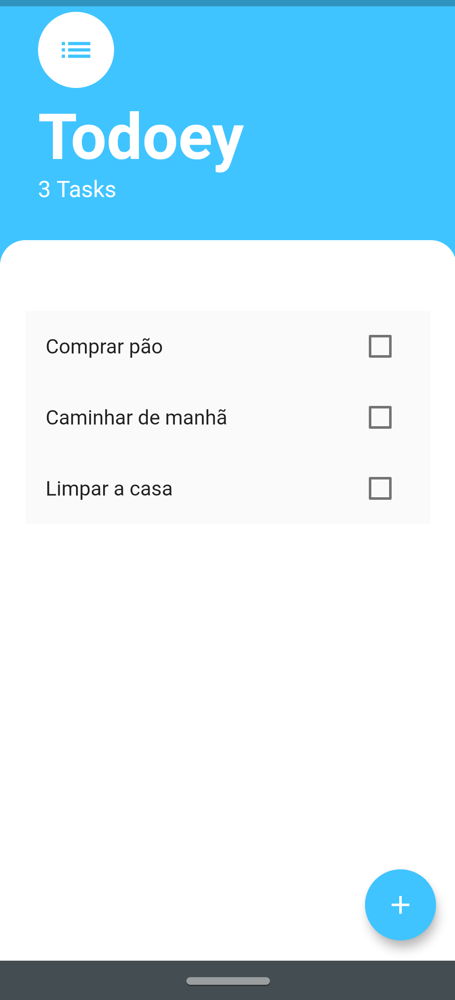

# todoey

A To-Do app built with Flutter.

Based on Flutter State Management module available in "The Complete 2021 Flutter Development Bootcamp with Dart" from Angela Yu.

## Result

## Dependencies
- [x] Provider

## To be Implemented
- [ ] MobX
- [ ] BLoC